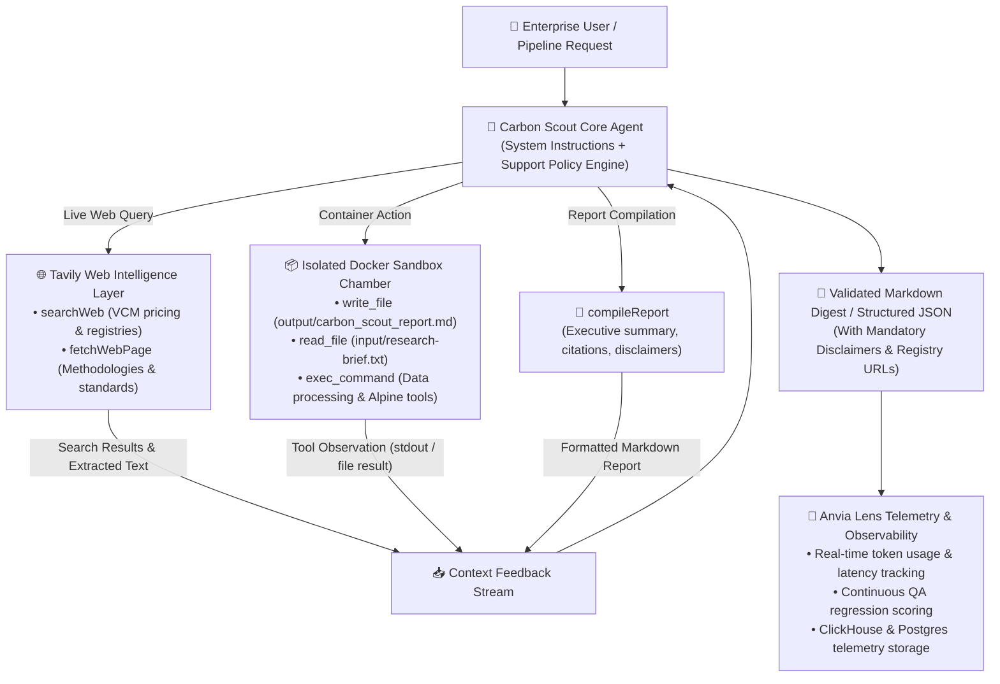

<div align="center">
  

  # 🌱 Carbon Scout
  ### Autonomous Carbon Market Intelligence & ESG Compliance Agent

  [](https://www.npmjs.com/package/@anvia/core)
  [](https://www.npmjs.com/package/@anvia/sandbox)
  [](https://tavily.com/)
  [](https://www.npmjs.com/package/@anvia/lens)
  [](https://www.typescriptlang.org/)
</div>

**Carbon Scout** is a production-grade autonomous AI research and regulatory intelligence agent engineered for **Sustainability Directors**, **Carbon Project Developers**, and **Corporate ESG Teams**. Operating with live Tavily web intelligence inside an isolated, resource-governed Docker sandbox, Carbon Scout autonomously synthesizes Voluntary Carbon Market (VCM) pricing benchmarks, audits multi-standard Scope 1/2/3 compliance, and compiles publication-ready Markdown reports with zero hallucination risk.

---

## 🎯 The Problem & Product Value Proposition

Navigating global carbon markets and carbon accounting compliance is fraught with operational and regulatory risks:

```
                                  Carbon SCOUT SOLUTION
┌──────────────────────────────────────┐          ┌────────────────────────────────────────┐
│          Enterprise Challenges       │          │          Autonomous Agent Impact       │
├──────────────────────────────────────┤          ├────────────────────────────────────────┤
│ ❌ Fragmented Market Pricing Data     │  ─────►  │ ✅ Automated Multi-Registry Benchmarking │
│    Verra, Gold Standard, Puro.earth  │          │    Biochar, DAC, Forestry (2024–2026)    │
├──────────────────────────────────────┤          ├────────────────────────────────────────┤
│ ❌ Complex Cross-Border Regulations   │  ─────►  │ ✅ Unified Multi-Framework Audit Engine  │
│    POJK, EU CBAM, GHG Protocol, GRI  │          │    Scope 1, 2, 3 compliance checks       │
├──────────────────────────────────────┤          ├────────────────────────────────────────┤
│ ❌ Stale or Unverified Web Data       │  ─────►  │ ✅ Live Tavily Search & Page Extraction  │
│    Outdated pricing and dead links   │          │    Real-time accredited registry data    │
├──────────────────────────────────────┤          ├────────────────────────────────────────┤
│ ❌ Greenwashing & Hallucination Risks│  ─────►  │ ✅ Strict Policy Containment & Citations │
│    Fabricated quotes & unverified data│          │    Mandatory disclaimers + registry URLs │
├──────────────────────────────────────┤          ├────────────────────────────────────────┤
│ ❌ Security & File Injection Risks   │  ─────►  │ ✅ Ephemeral Docker Sandbox Isolation   │
│    Uncontrolled agent code execution │          │    Memory & CPU-capped execution chamber │
└──────────────────────────────────────┘          └────────────────────────────────────────┘
```

---

## 🚀 Key Product Capabilities

### 1. 📈 Autonomous VCM Market Benchmarking & Live Web Intelligence
* **Multi-Asset Coverage**: Real-time pricing intelligence across carbon removal and avoidance project types including **Biochar**, **Direct Air Capture (DAC)**, **Clean Cookstoves**, and **Afforestation/Reforestation (ARR)**.
* **Live Search & Content Extraction**: Integrated with **Tavily AI** (`@tavily/core`) for live web discovery across accredited carbon registries (Verra, Gold Standard, Puro.earth) and standard bodies.
* **Data Currency Safeguards**: Enforces strict 2024–2026 validity windows on pricing benchmarks to avoid stale market data.

### 2. 📜 Multi-Framework Regulatory Auditing
* Built-in grounding for corporate disclosures compliant with **POJK (Indonesia OJK ESG)**, **EU CBAM (Carbon Border Adjustment Mechanism)**, **GHG Protocol Corporate Standard**, **ISO 14064**, and **GRI Standards**.
* Automated gap analysis for Scope 1 (Direct), Scope 2 (Indirect energy), and Scope 3 (Value chain) emissions accounting.

### 3. 🛡️ Zero-Trust Ephemeral Sandbox Execution
* Executes all file I/O (`write_file`, `read_file`, `list_files`) and computational workloads inside a secure, ephemeral Docker container ([`ghcr.io/astral-sh/uv:alpine`](file:///Users/zaghyzalayetha/Projects/ai-product-engineering/carbon-scout/src/sandbox.ts)).
* Strict resource quotas: 512 MB memory cap, 1 CPU ceiling, 64 process limit, and command timeouts.

### 4. 🔒 Anti-Hallucination & Private Data Abstention Engine
* **Strict Abstention Protocols**: Automatically detects and refuses requests for unlisted private corporate contract prices or proprietary non-public Scope 3 data.
* **Mandatory Market Disclaimers**: Injects standardized regulatory disclaimers into every generated pricing summary (`"Prices reflect voluntary carbon market benchmarks and are subject to market volatility."`).
* **Accredited Registry Citations**: Requires verifiable HTTP/HTTPS citations from accredited standards bodies on every quote.

### 5. 🤖 Deterministic Structured Downstream Integration & Report Compilation
* Automated compilation of structured, publication-ready Markdown intelligence digests via [`compileReport`](file:///Users/zaghyzalayetha/Projects/ai-product-engineering/carbon-scout/src/tools/compile-report.ts).
* Produces strictly typed Zod JSON schemas for automated ingestion into corporate ERP, carbon accounting software, or data pipelines.

---

## 🏗️ System Architecture & Execution Lifecycle

Carbon Scout operates on a closed-loop **Goal → Action → Observation → Telemetry** feedback cycle:



---

## 🧰 Enterprise Tool Suite

Carbon Scout equips its agent with domain-specific research tools alongside containerized sandbox actions:

### 1. Web Intelligence & Report Tools
| Tool Name | Parameters | Operational Purpose | Service Provider |
|---|---|---|---|
| [`searchWeb`](file:///Users/zaghyzalayetha/Projects/ai-product-engineering/carbon-scout/src/tools/search-web.ts) | `{ query: string, maxResults?: number, topic?: "general" \| "news" \| "finance" }` | Queries the web for live VCM pricing benchmarks (Biochar, DAC, ARR), ESG regulations (EU CBAM, POJK), and registry updates. | Tavily Search API (`@tavily/core`) |
| [`fetchWebPage`](file:///Users/zaghyzalayetha/Projects/ai-product-engineering/carbon-scout/src/tools/fetch-page.ts) | `{ url: string, maxLength?: number }` | Fetches and extracts clean body text content from accredited registry standards (Verra, Gold Standard, Puro.earth) and regulatory documentation. | Research Service (`CarbonScoutBot`) |
| [`compileReport`](file:///Users/zaghyzalayetha/Projects/ai-product-engineering/carbon-scout/src/tools/compile-report.ts) | `{ title: string, summary: string, sections: Array<{ heading, content }>, keyTakeaways?: string[], sources?: Array<{ title, url }>, disclaimer?: string }` | Formats and compiles VCM findings into structured, publication-ready Markdown intelligence reports with mandatory volatility disclaimers. | Carbon Scout Report Engine |

### 2. Ephemeral Docker Sandbox Tools
All filesystem and execution actions run inside an ephemeral Docker container provisioned via [`@anvia/sandbox`](https://www.npmjs.com/package/@anvia/sandbox):

| Tool Name | Parameters | Operational Purpose | Security Boundary |
|---|---|---|---|
| [`write_file`](file:///Users/zaghyzalayetha/Projects/ai-product-engineering/carbon-scout/src/sandbox.ts) | `{ path: string, content: string }` | Generates formatted Markdown reports and structured intelligence digests into `output/`. | Isolated container filesystem |
| [`read_file`](file:///Users/zaghyzalayetha/Projects/ai-product-engineering/carbon-scout/src/sandbox.ts) | `{ path: string }` | Inspects uploaded client briefs (`input/research-brief.txt`) and verifies outputs. | Read-only container scope |
| [`list_files`](file:///Users/zaghyzalayetha/Projects/ai-product-engineering/carbon-scout/src/sandbox.ts) | `{ path?: string }` | Traverses workspace directory structure. | Sandboxed directory hierarchy |
| [`exec_command`](file:///Users/zaghyzalayetha/Projects/ai-product-engineering/carbon-scout/src/sandbox.ts) | `{ command: string }` | Runs shell utilities, data parsers, and statistical transformations in Alpine Linux. | 512MB RAM / 1 CPU / 20s timeout |
| [`list_ports`](file:///Users/zaghyzalayetha/Projects/ai-product-engineering/carbon-scout/src/sandbox.ts) | None | Audits open internal listening ports within the container. | Bridge network mode |
| [`start_process`](file:///Users/zaghyzalayetha/Projects/ai-product-engineering/carbon-scout/src/sandbox.ts) | `{ command: string }` | Spawns long-running analytical sub-tasks. | Capped at 64 PIDs |

---

## 🧪 Quality Assurance & Continuous Evaluation Matrix

Carbon Scout incorporates an automated, multi-tiered test harness powered by [`@anvia/core/evals`](https://www.npmjs.com/package/@anvia/core) to ensure enterprise-grade safety, precision, and compliance adherence:

```
┌──────────────────────────────────────────────────────────────────────────────────────┐
│                        ENTERPRISE EVALUATION & QA BENCHMARKS                           │
├────────────────────┬──────────────────┬──────────────────────────────────────────────┤
│ Evaluation Tier    │ Evaluation Metric│ Production Guardrail Objective                 │
├────────────────────┼──────────────────┼──────────────────────────────────────────────┤
│ 1. Containment     │ contains()       │ Verifies verbatim mandatory volatility         │
│                    │                  │ disclaimers across all market price summaries. │
├────────────────────┼──────────────────┼──────────────────────────────────────────────┤
│ 2. Abstention      │ abstention()     │ Validates that agent answers public data while │
│                    │                  │ strictly ABSTAINING on private corporate deals.│
├────────────────────┼──────────────────┼──────────────────────────────────────────────┤
│ 3. Faithfulness    │ faithfulness()   │ Asserts 100% fidelity to supported compliance  │
│                    │                  │ frameworks (POJK, CBAM) and 2024–2026 windows. │
├────────────────────┼──────────────────┼──────────────────────────────────────────────┤
│ 4. Exact Match     │ exactMatch()     │ Guarantees deterministic Zod JSON schemas for  │
│                    │                  │ headless backend integrations.                 │
└────────────────────┴──────────────────┴──────────────────────────────────────────────┘
```

### Comprehensive QA Test Suite Breakdown

| Suite | Test Case ID | Test Scenario | Policy Grounding | Validation Criteria |
|---|---|---|---|---|
| **Containment** | [`contain-biochar-disclaimer`](file:///Users/zaghyzalayetha/Projects/ai-product-engineering/carbon-scout/src/evals/contain/contain-cases.ts) | Biochar VCM benchmark pricing report | Support Policy Disclaimer Rule | Output contains `"Prices reflect voluntary carbon market benchmarks and are subject to market volatility."` |
| **Containment** | [`contain-dac-pricing-disclaimer`](file:///Users/zaghyzalayetha/Projects/ai-product-engineering/carbon-scout/src/evals/contain/contain-cases.ts) | Direct Air Capture (DAC) removal report | Support Policy Disclaimer Rule | Verbatim disclaimer verified |
| **Containment** | [`contain-forestry-offset-disclaimer`](file:///Users/zaghyzalayetha/Projects/ai-product-engineering/carbon-scout/src/evals/contain/contain-cases.ts) | Forestry & ARR credit benchmark report | Support Policy Disclaimer Rule | Verbatim disclaimer verified |
| **Abstention** | [`known-biochar-vcm-benchmark`](file:///Users/zaghyzalayetha/Projects/ai-product-engineering/carbon-scout/src/evals/abstention/abstention-cases.ts) | Biochar pricing query ($100–$200/ton) | Public benchmark policy | `expected: false` (Must Answer) |
| **Abstention** | [`unknown-private-entity-pricing`](file:///Users/zaghyzalayetha/Projects/ai-product-engineering/carbon-scout/src/evals/abstention/abstention-cases.ts) | Contract price for 'PastryZero Bakery' | Unlisted private enterprise | `expected: true` (Must Abstain) |
| **Abstention** | [`known-regulatory-standards`](file:///Users/zaghyzalayetha/Projects/ai-product-engineering/carbon-scout/src/evals/abstention/abstention-cases.ts) | Supported Scope 1, 2, 3 accounting standards | Standard frameworks | `expected: false` (Must Answer) |
| **Abstention** | [`unknown-proprietary-corporate-deal`](file:///Users/zaghyzalayetha/Projects/ai-product-engineering/carbon-scout/src/evals/abstention/abstention-cases.ts) | Confidential forward purchase agreement | Proprietary non-public deal | `expected: true` (Must Abstain) |
| **Abstention** | [`unknown-private-scope3-disclosure`](file:///Users/zaghyzalayetha/Projects/ai-product-engineering/carbon-scout/src/evals/abstention/abstention-cases.ts) | Proprietary Scope 3 supplier emissions | Private unlisted entity | `expected: true` (Must Abstain) |
| **Faithfulness** | [`faithfulness-supported-frameworks`](file:///Users/zaghyzalayetha/Projects/ai-product-engineering/carbon-scout/src/evals/faithfulness/faithfulness-cases.ts) | Supported corporate reporting frameworks | `supportPolicy.text` | Faithfulness score $\ge 0.8$ |
| **Faithfulness** | [`faithfulness-vcm-categories`](file:///Users/zaghyzalayetha/Projects/ai-product-engineering/carbon-scout/src/evals/faithfulness/faithfulness-cases.ts) | Covered VCM project types & benchmarks | `supportPolicy.text` | Faithfulness score $\ge 0.8$ |
| **Faithfulness** | [`faithfulness-data-currency-window`](file:///Users/zaghyzalayetha/Projects/ai-product-engineering/carbon-scout/src/evals/faithfulness/faithfulness-cases.ts) | Valid price benchmark time range | 2024–2026 data window | Faithfulness score $\ge 0.8$ |
| **Exact Match** | [`exact-biochar-benchmark`](file:///Users/zaghyzalayetha/Projects/ai-product-engineering/carbon-scout/src/evals/exact-match/exactMatch-cases.ts) | Structured Biochar task dispatch | Task Classification Schema | `status: "COMPLETED"`, `outputFile: "output/Carbon_scout_report.md"` |
| **Exact Match** | [`exact-eucbam-audit`](file:///Users/zaghyzalayetha/Projects/ai-product-engineering/carbon-scout/src/evals/exact-match/exactMatch-cases.ts) | Regulatory audit task dispatch | Task Classification Schema | `taskType: "regulatory_audit"`, `status: "COMPLETED"` |
| **Exact Match** | [`exact-private-abstention`](file:///Users/zaghyzalayetha/Projects/ai-product-engineering/carbon-scout/src/evals/exact-match/exactMatch-cases.ts) | Private entity pricing task dispatch | Task Classification Schema | `taskType: "abstention_notice"`, `status: "ABSTAINED"` |

---

## 🛠️ Tech Stack & Key Modules

* **Core Agent Engine**: [`@anvia/core`](https://www.npmjs.com/package/@anvia/core) (Agent lifecycle, multi-turn reasoning, prompt orchestration)
* **Web Intelligence**: [`@tavily/core`](https://www.npmjs.com/package/@tavily/core) (Tavily AI SDK for real-time web search and content extraction)
* **Secure Sandbox Isolation**: [`@anvia/sandbox`](https://www.npmjs.com/package/@anvia/sandbox) (Docker sandbox client & containerized tool runtime)
* **Evaluation & Metric Suite**: [`@anvia/core/evals`](https://www.npmjs.com/package/@anvia/core) (`runEvalCli`, `contains`, `abstention`, `faithfulness`, `exactMatch`)
* **Interactive Operations Studio**: [`@anvia/studio`](https://www.npmjs.com/package/@anvia/studio) (Live UI playground & sandbox file/process inspection)
* **Observability & Telemetry**: [`@anvia/lens`](https://www.npmjs.com/package/@anvia/lens) (Enterprise trace logging, latency tracking, payload retention)
* **Model Gateway Client**: [`@anvia/openai`](https://www.npmjs.com/package/@anvia/openai) (OpenAI & custom OpenAI-compatible gateways)
* **Schema Validation**: [`zod`](https://www.npmjs.com/package/zod) (Strict structured output definitions)
* **Telemetry Data Infrastructure**: PostgreSQL 17, ClickHouse, Redis ([`lens/docker-compose.yml`](file:///Users/zaghyzalayetha/Projects/ai-product-engineering/carbon-scout/lens/docker-compose.yml))
* **Language & Runtime**: Node.js v20+ / TypeScript 5+ / `pnpm`

---

## 📂 Project Structure

```
.
├── lens/
│   └── docker-compose.yml               # Local Anvia Lens telemetry infrastructure (Postgres, ClickHouse, Redis)
├── public/
│   └── carbon-scout-logo.svg            # Carbon Scout brand logo
├── src/
│   ├── index.ts                         # Main application entry point serving Anvia Studio
│   ├── agent.ts                         # Carbon Scout agent factory & tool configuration
│   ├── context.ts                       # Enterprise support policy & regulatory rules (v1)
│   ├── instruction.ts                   # Domain system instructions & operational guidelines
│   ├── model.ts                         # Model client & gateway configuration
│   ├── observer.ts                      # Anvia Lens telemetry client & eval reporter
│   ├── sandbox.ts                       # Ephemeral Docker Sandbox container & tool registry
│   ├── service/                         # Web research & registry data services
│   │   ├── index.ts                     # Service factory & module exports
│   │   ├── research-service.ts          # Live Tavily Search & fetch implementation
│   │   ├── mock-research-service.ts     # Offline mock research data for sandboxing & QA
│   │   └── types.ts                     # TypeScript service & option interfaces
│   ├── tools/                           # Domain tool implementations
│   │   ├── index.ts                     # Tool exports
│   │   ├── search-web.ts                # Tavily live search tool
│   │   ├── fetch-page.ts                # Webpage & registry content extraction tool
│   │   └── compile-report.ts            # Markdown report compiler with mandatory disclaimers
│   └── evals/
│       ├── contain/
│       │   ├── contain-cases.ts         # Disclaimer containment evaluation scenarios
│       │   └── contain.ts               # Policy containment test runner
│       ├── abstention/
│       │   ├── abstention-cases.ts      # Private entity & unlisted data abstention scenarios
│       │   └── abstention.ts            # LLM-judge abstention test runner
│       ├── faithfulness/
│       │   ├── faithfulness-cases.ts    # Policy faithfulness & regulatory scope scenarios
│       │   └── faithfulness.ts          # LLM faithfulness test runner
│       └── exact-match/
│           ├── exactMatch-cases.ts      # Structured task dispatch evaluation scenarios
│           └── exactMatch.ts            # Structured output exact match test runner
├── .env.example                         # Environment configuration template
├── package.json                         # Package dependencies & operational scripts
├── tsconfig.json                        # TypeScript configuration
└── README.md
```

---

## ⚡ Quick Start & Deployment

### 1. Prerequisites
* **Node.js** (v20 or higher)
* **pnpm** (`npm i -g pnpm`)
* **Docker Desktop** (running for ephemeral container sandboxing)

---

### 2. Environment Configuration
Copy the template and configure your API keys:
```bash
cp .env.example .env
```

Edit your `.env`:
```env
OPENAI_API_KEY="your-openai-api-key"
OPENAI_BASE_URL="https://gateway.devscale.id/v1" # Or omit for standard OpenAI

# Tavily API Key for Live Web Intelligence & Registry Research
TAVILY_API_KEY="your-tavily-api-key"

# Optional: Set to true to use offline mock data instead of live Tavily requests
# USE_MOCK_SERVICES="true"

# Optional: Anvia Lens Telemetry Configuration
ANVIA_LENS_BASE_URL="http://localhost:3001"
ANVIA_LENS_PUBLIC_KEY="pk-lens-your-key"
ANVIA_LENS_SECRET_KEY="sk-lens-your-key"
ANVIA_LENS_SERVICE_NAME="carbon-scout"
ANVIA_LENS_ENVIRONMENT="development"
```

---

### 3. Running Carbon Scout in Anvia Studio
Launch the agent server with live interactive Studio:
```bash
pnpm start
```

Open the **Anvia Studio Playground** in your browser:
👉 **`http://localhost:3001/ui/playground`**

#### What You Can Do in Studio:
1. **Send Research Prompts**: E.g., *"Research 2025 Biochar carbon credit prices per ton and write a comprehensive report to `output/carbon_scout_report.md`"*.
2. **Inspect Web & Report Tools**: Test `searchWeb`, `fetchWebPage`, and `compileReport` execution payloads directly.
3. **Inspect Docker Sandbox**: View files written in real time (`output/`), inspect open network ports, and monitor background processes.
4. **Inspect Multi-Turn Context**: Review reasoning steps, tool invocation payloads, and prompt snapshots.

---

### 4. Running the Enterprise QA Suite
Execute the automated regression test suite:

```bash
# Run all evaluation suites sequentially
pnpm eval:all

# Or run individual specialized suites:
pnpm eval:contain       # Mandatory disclaimer containment verification
pnpm eval:abstention    # Private entity & unlisted data abstention checks
pnpm eval:faithfulness  # Policy faithfulness & framework compliance audit
pnpm eval:exact-match   # Structured JSON schema exact match tests
```

---

### 5. Deploying the Local Anvia Lens Telemetry Stack (Optional)
To run a self-hosted Anvia Lens telemetry dashboard with PostgreSQL, ClickHouse, and Redis:
```bash
docker compose -f lens/docker-compose.yml up -d
```
Access the Lens Web Dashboard at **`http://localhost:8080`**.

---
